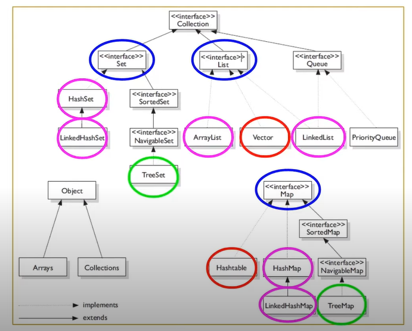
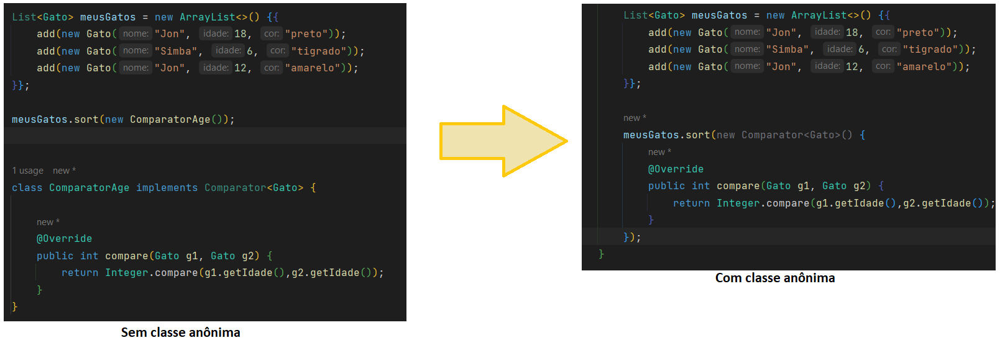
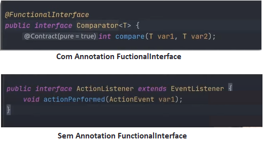
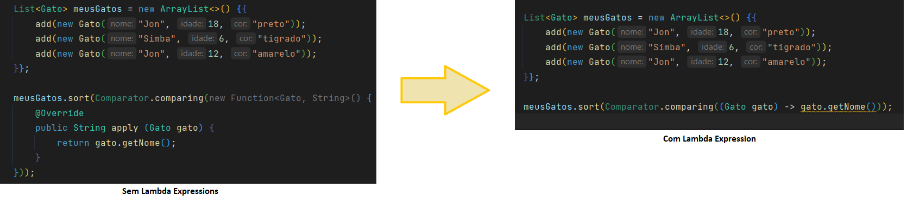
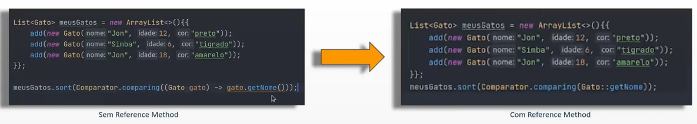

# Collections
___

### INTRODUÇÃO

Mentor: Camila Cavalcante

Objetivos do curso: Compreender o que é o Collection Framework e a aplicabilidade de suas principais interfaces:
List, Set e Map. Além de aprender sobre Stream API e como ela pode ajudar na manipulação de collections. 

* Percurso:
    * Aula 1: Coleções com iterações ordenadas:List
    * Aula 2: Coleções com Singularidade: Set
    * Aula 3: Coleções de Pares: Map
    * Aula 4: Stream API

* Visão geral: Collections Framework
  * O que são e por que usamos Collections Framework?
  *  Composição
  * Hierarquia
    
* Definição:
  * Collection é um obejto que agrupa múltiplos elementos (variáveis primitivas ou objetos) dento de uma única unidade.
  * Serve para armazenar e processar conjuntos de dados de forma eficiente.
      
* Composição:
  * Interfaces: è um contrato que quandso assumido por uma classe deve ser implementado. 
  * Implementação ou Classes: são as materializações, a codificação das interfaces. 
  * Algoritmos: é uma sequencia lógica, finita e definida de instruções que devem ser seguidas para resolver um problema. 
  
  * Hierarquia Collections: 

##### AULA 1 - LISTS
* java.util.list - pacote
* Características: permite elementos duplicados e garante ordem de inserção. 
  

* Implementações:
	* Implementação Vector: utilizada quando precisamos de Threads
	* Implementação ArrayList: implementa apenas a interface List.
	* Implementação LinkedList: Implementa tanto  a interface List quanto a Queue.
  
	
* ArrayList x LinkedList : ArrayList deve ser usado onde mais operações de pesquisa são necessárias e LinkedList deve ser usado onde mais operações de inserção e exclusão são necessárias.  
OBS.: Em caso de dúvida, utilize o ArrayList. 

##### AULA 2 - SET
* java.util.Set - pacote
* Características: Não permite elementos dublicados, não possui indice. Não é possível utilizar métodos get e set. 
* Treeset - Utiliza o TreeMap para armazenar os elementos, utilizada para ordenação natural dos elementos. 
* LikedHashSet - Utiliza o LinkedHashMap para armazenar os elementos. Mantém a ordem de inserção dos elementos. 
* HashSet - Utiliza HashMap para armazenar os elementos. Não mantém nenhuma ordem dos elementos. 

##### AULA 3 - MAP
* Coleção de pares
* java.util.Map - pacote
* Não extende da Interface Collection
* Permite multiplos elementos, porém possui uma key e um value
* As keys tem que ter valores unícos
* Hashtable - Tread safe, antiga. 
* TreeMap — Bastante utilizadeo para comparação /ordenação — Itera conforme a ordem natural de keys ou comparator, não permite key nula
* HashMap - Itera os elementos aleatoriamente, permite key nula
* LinkedHashMap - Itera os elementos pela ordem de inserção, permikey nula, 

##### AULA 4 - Stream
* Objetivo da Streams API: Facilitar a manipulação de Collections
  
* Requisitos:
    * Classe Anônima: Classe sem nome que é criada e instanciada em uma ú nica instrução. Utilizada quando a classe será 
instanciada uma única vez e em classes pequenas que possuem poucas funções/responsabilidades.  
       
      * Functional Interface: Interface que possui apenas um método abstrato (SAM - Single Abstract Method) e sua 
implementação pode ser tratada com expressões lambdas. 
      
        Exemplos:
      * Comparator
      * Consumer
      * Function
      * Predicate
      * Lambda: função sem declaração, isto é, sem o nome, o tipo de retorno e o modificador de acesso. 
A ideia é que o método seja declarado no mesmo lugar em que será usado. As funções lambdas em Java tem a sintaxe
definifa como (argumento) -> (corpo). 
         
      * Reference Method: Permite fazer uma referência a um método ou construtor de uma classe (de forma funcional) 
e assim indicar que ele deve ser utilizado num ponto específico do código, deixando-o mais legível. Para utilizá-lo, 
basta informar uma classe ou referência seguida do símbolo "::" e o nome do método sem os parênteses no final. 
         
      * Implementação da Streams API: Segue os princípios da programação funcional. Combinada com as expressões lambda, ela 
      proporciona uma forma diferente de lidar com conjuntos de elementos, oferecendo ao desenvolvedor uma maenira simples e 
      consisa de escrever o código. 
       
      Fonte (Collection) -> Operações Intermediárias -> Operação Terminal