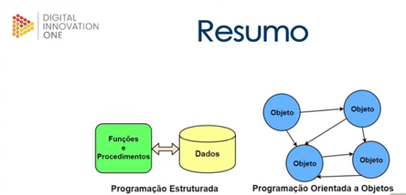

# Programação Orientada a Objetos
___

* Introdução:

Mentor: Thiago Leite e Carvalho

Objetivos do curso: Compreender todos os conceitos relativos à orientação a Objetos (OO);
Baseado no livro de mesmo título escrito pelo mentor. 

* Percurso:
  * Aula 1: Por que usar? 
  * Aula 2: Fundamentos 
  * Aula 3: A estrutura 
  * Aula 4: As relações 
  * Aula 5: A Organização 
  * Aula 6: Próximos passos
  
AULA 1 - Por que usar?

* Paradigma Estruturado x Paradigma Orientado à Objetos

| Paradigma Estruturado               | Paradigma Orientado à Objetos                             |
|-------------------------------------|-----------------------------------------------------------|
| Representação mais simplista        | Representação mais realista                               |
| Linguagem C                         | Linguagem Java                                            |
| Foco em operações (funções) e dados | Foca na modelagem de entidades e na interação entre estas |
| Manipulação de dados brutos         | Maior abstração que nas linguagens estruturadas           |
| Foco em "como fazer"                | Foco no "o que fazer"                                     |

* Vantagens da POO:
  * Melhor coesão: unidades de códigos com responsabilidades específicas 
  * Melhor acoplamento: bons acompamentos são flexíveis em POO. 
  * Diminuição do Gap semântico: diminuição da diferença de representação entre o mundo real e do mundo computacional. 
  * Coletor de lixo: as linguagens orientadas a objetos possuem mecanismos que vão limpando objetos que não são  
utilizadas para liberar a memória do computador. 

AULA 2 - FUNDAMENTOS

* Definição de Orientação a Objetos:  
Análise, projeto e programação baseados na composição e interação entre diversas unidades de software chamadas de objetos.

* Pilares:
  * Abstração: capacidade de pensar nas características mais essenciais e deixar de lado as caracteristicas mais específicas. 
Processo pelo qual se isolam as características mais comuns de um grupo de objetos.   
    * Por exemplo: Cadeira possui encosto, assento e pernas.
Podemos ter diversos tipos de cadeira a partir dessa abstração: cadeira de praia, cadeira de sala de aula, possuem as  
caracteristicas comuns do grupo e algumas específicas. 
  * Reuso: capacidade de criar novas unidades de código a partir de outras já existentes.
  * Encapsulamento: Capacidade de esconder complexidades e proteger dados (evitar acessos indevidos).

Exercitando: 
Levando em consideração uma loja online de livros, modele uma entidade livro.  
Livro: Quantidade de páginas, tema, edição, assunto, titulo, sub-titulo,  autor, ano de publicação, editora, ISBN.  
Livro (Essencial): Quantidade de páginas, ISBN, assunto, título, autor e editora.  
Livro (Editora): Quantidade de páginas, tipo de papel, tipo de capa, peso, acabamento, coloração, gramatura, ISBN, sub-título. 
Obs. A necessidade da modelagem influencia na caracterização da entidade.  
É importante pensar no que é necessário para a aplicação a ser desenvolvida. 
